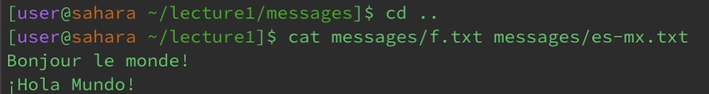

## Lab Report 1

**cd example**

1. Entering cd with no argument does nothing because there is no directory that the current working one can change to. Since this doesn't cause an error, the terminal continues as is.

2. When entering cd with a path to the lecture1 directory (argument) in the home directory (cwd), we change from home to lecture1. 

3. If you enter cd with a path to any file (argument) it causes an error because cd only takes directories as arguments. 

**ls example**

1. Entering ls with no argument will list the files and folders that are in the current working directory. In this example, only lecture1 is in the home directory

2. When entering ls with a path to the lecture1 directory (argument) in the home directory (cwd), the files and folders of the lecture1 get listed. 

3. Entering ls with a path to a file (argument) will only list itself since it does not have any files or folders but this does not cause an error. 

**cat example**

1. An error is caused when only cat is entered with no arguments in the messages directory (cwd). Without arguments, there are no files to copy and concatenate which results in a runtime error.

2. When entering cat with paths to a directory (arguments) in the messages directory (cwd), the content of the two files get concatenated and printed. 

3. Entering cat with paths to a file (arguments) in the lecture1 directory (cwd) print the concatenated content of the two files. 

