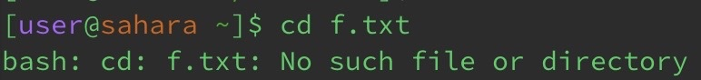
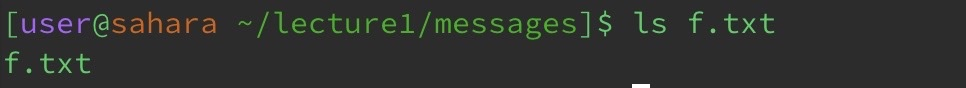

## Lab Report 1

**cd example**

1. Entering cd with no argument within the lecture1 current working directory returns you to the home directory. If you are already in the home directory, this doesn't cause an error, you remain there and the terminal continues as is.
.jpeg)

2. When entering cd with a path to the lecture1 directory (argument) in the home directory (cwd), we change from home to lecture1. This is not an error.

4. If you enter cd from the home directory (cwd) with a path to any file (argument) it causes an error because cd only takes directories as arguments. 

**ls example**

1. Entering ls with no argument will list the files and folders that are in the current working directory. In this example, only lecture1 is in the home directory (cwd). This is not an error since it does what is intended.
   

2. When entering ls with a path to the lecture1 directory (argument) in the home directory (cwd), the files and folders of the lecture1 get listed. This does what it's meant to meaning it's not an error.
   

3. Entering ls with a path to a file (argument) will only list itself since it does not have any files or folders but this does not cause an error. 

**cat example**

1. An interesting action happens when only cat is entered with no arguments in the messages directory (cwd). Without arguments, cat takes the standard input of the user from the terminal and returns the exact input as output. Although there are no files as arguments to copy and concatenate, this command is not an error.

2. When entering cat with paths to a directory (arguments) in the lecture1 directory (cwd), the terminal lets us know that the arguments are directories and not much can be done with its contents since they aren't files. This isn't an error but it doesn't concatenate the contents of directories like it would with files.

3. Entering cat with paths to a file (arguments) in the lecture1 directory (cwd) print the concatenated content of the two files. No errors here!

