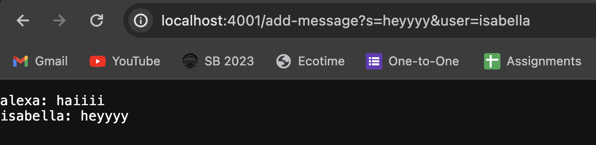
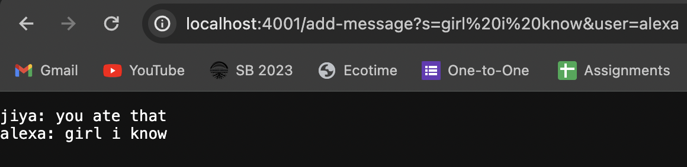

## Lab Report 2

**/add-message example 1**

- When using the /add-message path with the simple one word arguments, it is taken as an argument by the Handler class method, handleRequest, which is all in ChatServer.java. This method is the only one that takes the Web Server url so it's the only one directly called when /add-message is entered. Other methods such as equals, split, and contains are also ran with these simple arguments.
- The url is the most relevant argument for the method and the specific values of the query, s and user which are grabbed by splitting them into an array are the most relevant fields of the class since we are taking them and returning them to make the ChatServer function.
- The values change depending on the user's input and but the type of the fields ultimately remain Strings. So if the user inserts integers, since it's taken as an argument the program will utilize it as a string and they remain that way.

- When using the /add-message path with arguemtns that are multiple words, the same methods are ran since the if statement and indexing did most of the work to determine where to correctly split the user's input to creat valid outputs. 
- Same thing as the other example with the url being the most relevant argument for the method and the specific values of the query, s and user.
- The values are still strings but the index was different for the amount of words that the value of s was given. The program excutes about the same despite there being more words though, the main difference is how the string that gathers the chat line of each /add-message path is returned.

import java.io.IOException;
import java.net.URI;

    class Handler implements URLHandler {
    
    String str2 = "";
    

    public String handleRequest(URI url) {
        if (url.getPath().equals("/add-message")) {
            String[] parameters = url.getQuery().split("=");

            if (parameters[1].contains("&")) {
                String[] str = parameters[1].split("&");
                str2 += parameters[2] + ": " + str[0] + "\n";
                return str2;
            }
            str2 += parameters[2] + ": " + parameters[1] + "\n";
            // System.out.println(str2);
            return str2;
        }
        return "404 Not Found!";
    }
    }
    class ChatServer {
    public static void main(String[] args) throws IOException {
        if(args.length == 0){
            System.out.println("Missing port number! Try any number between 1024 to 49151");
            return;
        }

        int port = Integer.parseInt(args[0]);

        Server.start(port, new Handler());
    }
    }

This week of lab humbled me because I thought I remembered how to store the string values of the users' input to have them print out on the same page but I completely forgot that this idea is related to the incrementing of integers in the NumberServer example we've done before. I learned to go through the resources from lecture and previous labs more thoroughly because the solutions to many problems I face in my code are right in front of me most of the time.
